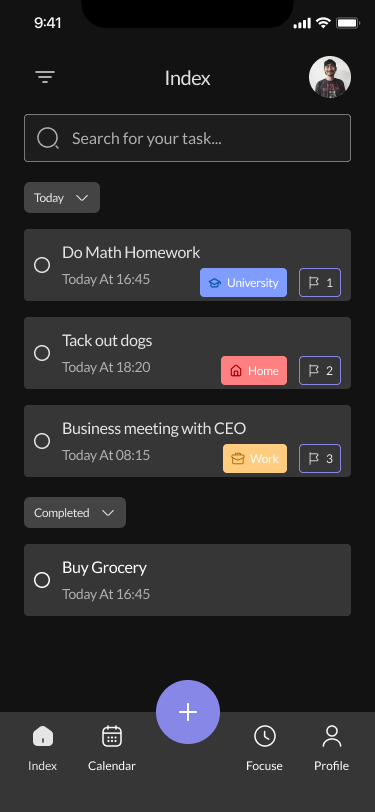

<h1 align="center">
  UpTodo - Todo List App UI Kit (Community)
</h1>

  Flutter (UI) with GetX for State Management & Navigation.

  
  
  
  
  

  

## Socials

You can check preview video on my instagram.

- [Instagram](https://www.instagram.com/masyon.dev/)

## Credits

Design by [Amir Baghestani](https://www.figma.com/community/file/1083383246788717048)
